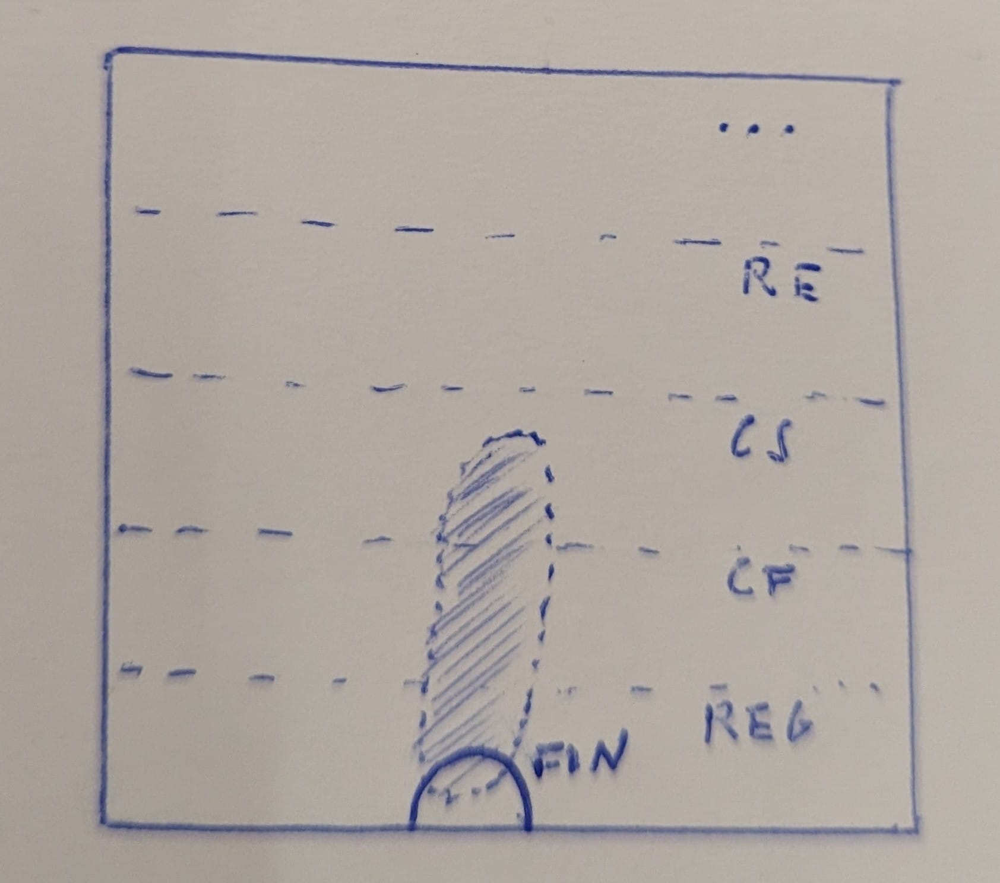
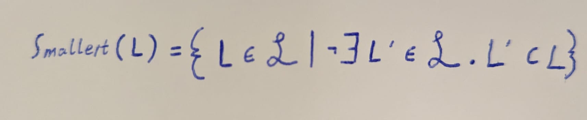
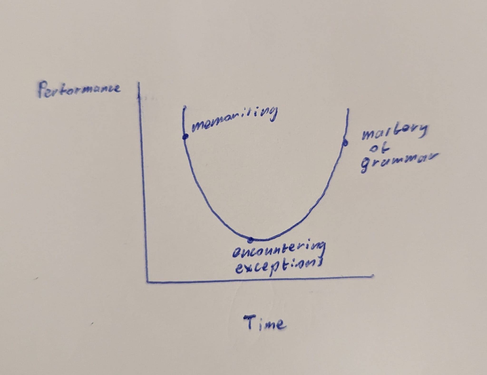
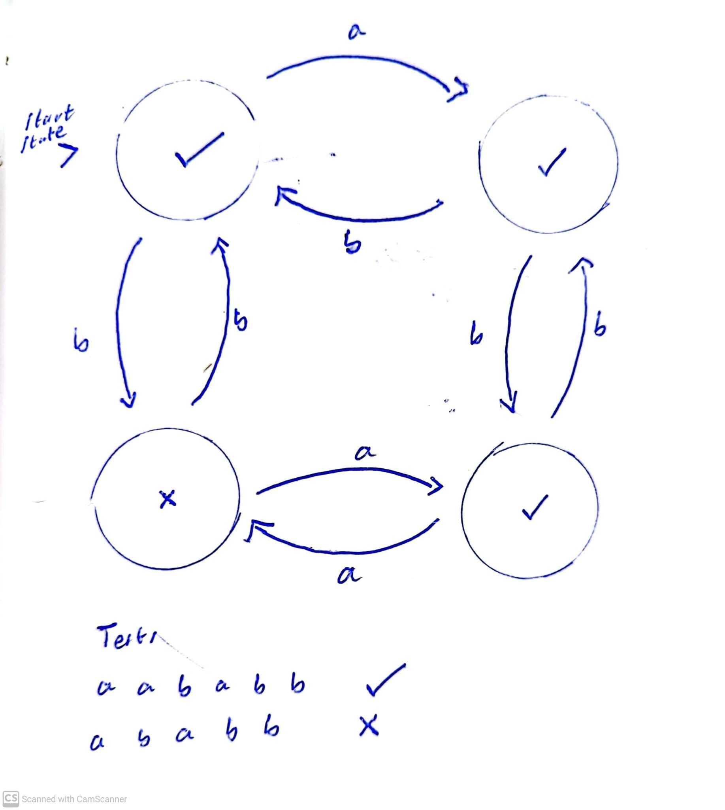
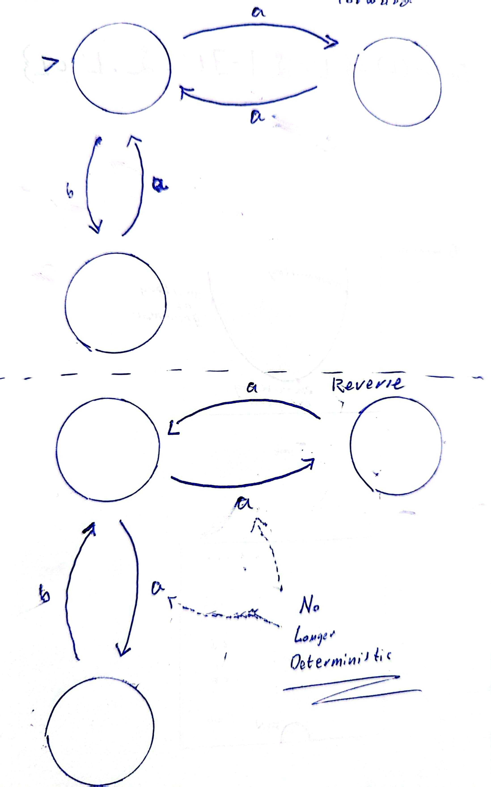

## Take-Home Messages of the Previous Theorem
This theorem was perceived as a disaster...
  * Any single grammar formalism that anyone ever thought was interesting, (*context-free*, *context-sensitive*, etc) is subsumed under this theorem. It says that **none of them are learnable**.
  * As a linguist, you might think *"Oh, Chomsky wanted to have these grammars which include things like context-free and context-sensitive etc, which means that none of the grammars that Chomsky is interested in are learnable."*

We have a hierarchy of types of languages which you can see below:
```
FINITE ⊂ REGULAR ⊂ CONTEXT FREE ⊂ CONTEXT SENSITIVE ⊂ RECURSIVELY ENUMERABLE
```
The theorem comes to the conclusion that none of the above types of language are learnable. Therefore, we must be thinking about the learnability of language in the wrong way.

#### What is actually learnable then?
Well, with the devastating theorem introduced previously, we know that the types of languages we're interested in are not learnable. However, **maybe a subset of these languages are**. For instance, maybe the shaded in section below is learnable, and outside this section is not...



## Overlapping of Languages

**Definition**: Smallest Language of a Class<br>
The smallest languages of a class are the languages which are not just a subset of the languages of those class. Note that **CursL** represents the **set of languages in a class**. For instance:
```
CursL = {English, German, French}
```
English would be a smallest language of this class, but the set of expressions ("Hello", "How are you?") would not be a smallest language of this class, as it is a subset of English. German and French also can be a smallest language of this class, but any subset of their sentences would not be.



#### Distinguishing set DSmallL
DSmallL is a finite set of sentences which distinguishes a language L from any other. For instance,
```
L = {English, German, French}
DSmallL = {Hi mom, How are you?}
```
In this case, the *smallest language* in CursL would be English for the *distinguishing set* DSmallL.

## U-Shaped Learning
**Definition**: A U-shaped curve in a cognitive-developmental trajectory refers to a three-step process: **good performance followed by bad performance followed by good performance once again**.<br>

#### Over-Generalisation
An example of u-shaped learning is in babies which are learning the rules of language for the first time. We see that at the beginning they are memorising exactly what they've heard and so their linguistic performance is high since they are saying acceptable sentences. However, over time they over-generalise what they are seeing in the data they are presented with an encounter exception to the rules (for instance, irregular verbs). Then they learn these exceptions and they reach the high point again on the curve.


## Regular Language
**Definition**: "A **regular language** is a language that can be expressed with a [regular expression](https://brilliant.org/wiki/regular-expressions/) or a deterministic or non-deterministic [finite automata](https://brilliant.org/wiki/finite-state-machines/) or state machine."

We can see below the modelling of a very simple and deterministic Finiste State Automaton, which will accept certain states (represented by a tick) and reject other (represented by an X).


These types of machines can be **forward-deterministic**, which means they are deterministic in this original form like we see above, and they can also be **reverse-deterministic**, which means that they remain deterministic even after we reverse the direction of the arrows and swap the *start states* with the *terminal / end states*.
<br>
We're interested in **machines where the reverse-machine is non-deterministic**. We can see an example of a deterministic machine whose reverse-machine is non-deterministic below.


The reason that the above becomes non-deterministic is that we see there is the case of the top-left node where an "a" is given as input. In this case, there are two options for which state an "a" input ought to lead to.

#### Batch vs Incremental
There are two different ways in which we can supply data to machines such as these. These are **batch** and **incremental**. A batch of data could be something like the following:
```
D_Batch = {aa, bb, aaaa, abab}, then do something with all this data.

D_Incremental = {aa}, do something, {bb}, do something, {aaaa}, do something, {abab}, do something.

```

In our case, we will be looking at learners working with Batch data. 

## Our Learner
Imagine a batch-data learner as one which hears X number of sentences before forming or making adjustments to its grammar for that language, while for an incremental-data learner, the learner adjusts its grammar one datum at a time. Additionally, the learner knows that its grammar must be both forward- and backward-deterministic.

The steps for learning are as follows:
1. Create A Prefix Tree Acceptor (PTA, will be explained in following lecture)
2. Look at its grammar so far, see whether it's reversable, and if not then take steps to make it reversable.

The other main question now, is **how can we make our learner generalise about the grammar of a language?**
